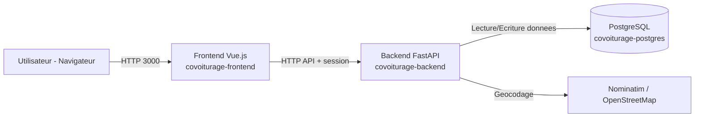
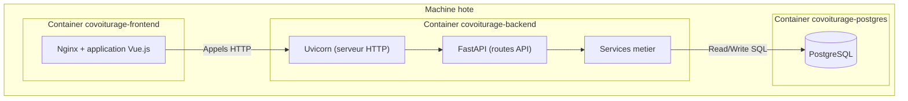

# Architecture Technique

## Vue d'ensemble runtime

- `frontend`: application web utilisateur (Vue.js) servie par Nginx
- `backend`: API HTTP et orchestration metier (FastAPI + Uvicorn)
- `database`: persistance relationnelle (PostgreSQL)
- `service cartographique externe`: geocodage et geocodage inverse (Nominatim / OpenStreetMap)

## Schema des flux (mermaid)



## Schema de placement conteneurs (mermaid)



## Arbre d'architecture et roles

```text
/
|-- backend/                     # logique applicative et endpoints HTTP
|   |-- api/                     # routes, schemas DTO, gestion de session
|   |-- services/                # regles metier (parsing, matching, geocodage)
|   |-- models/                  # entites metier
|   |-- database/                # acces a la base de donnees
|   |-- core/                    # configuration et utilitaires globaux
|   `-- messages.py              # catalogue messages metier
|-- frontend/                    # interface utilisateur Vue.js
|   |-- src/
|   |   |-- api/                 # client HTTP + appels endpoints
|   |   |-- stores/              # etat applicatif et orchestration UI
|   |   |-- pages/               # ecrans
|   |   |-- components/          # composants reutilisables
|   |   |-- router/              # navigation
|   |   `-- assets/              # styles
|   `-- tests/                   # unit + e2e frontend
|-- doc/                         # documentation technique
|-- scripts/
|   |-- start-local.ps1          # demarrage compose + recap URL
|   |-- start-local-no-build.ps1 # demarrage compose sans rebuild des images
|   `-- stop-local.ps1           # arret des services locaux
|-- docker-compose.yml           # orchestration locale
|-- Dockerfile.backend           # image backend
|-- frontend/Dockerfile.frontend # image frontend
`-- .env / .env.example          # configuration
```

## Services Docker

- `backend`: build `Dockerfile.backend`, conteneur `covoiturage-backend`, port `${BACKEND_PORT}`
- `frontend`: build `frontend/Dockerfile.frontend`, conteneur `covoiturage-frontend`, port `${FRONTEND_PORT}`
- `database`: image `postgres:16-alpine`, conteneur `covoiturage-postgres`, port `5432`

## Services externes

- `Nominatim / OpenStreetMap`
- Role: convertir une adresse en coordonnees (`lat/lon`) et faire le geocodage inverse.
- Utilisation: edition de profil, selection d'adresse, positionnement carte.
- Nature: service externe HTTP appele par le backend (non conteneurise dans ce projet).
- Comportement si indisponible: la recherche d'adresse peut echouer ou etre degradee, mais le reste de l'application continue de fonctionner.

## Logs explicites de demarrage

Utiliser le script equipe:

```powershell
./scripts/start-local.ps1
```

Variante sans rebuild:

```powershell
./scripts/start-local-no-build.ps1
```

Le script affiche:
- URL Frontend
- URL Backend API
- URL Health API
- et l'etat des conteneurs (`docker compose ps`)
