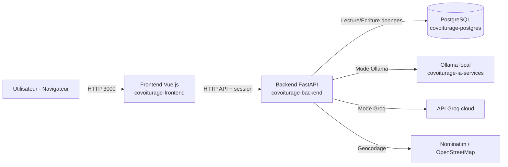
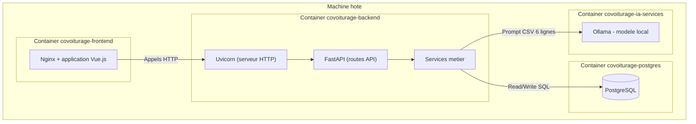

# Architecture Technique

## Vue d'ensemble runtime

- `frontend`: application web utilisateur (Vue.js) servie par Nginx
- `backend`: API HTTP et orchestration metier (FastAPI + Uvicorn)
- `database`: persistance relationnelle (PostgreSQL)
- `ia-services`: inference locale optionnelle pour mapping CSV (Ollama)
- `Groq`: inference cloud utilisee par le demarrage Groq
- `service cartographique externe`: geocodage et geocodage inverse (Nominatim / OpenStreetMap)

## Schema des flux (mermaid)


```mermaid
flowchart LR
  U[Utilisateur - Navigateur] -->|HTTP 3000| FE[Frontend Vue.js\ncovoiturage-frontend]
  FE -->|HTTP API + session| BE[Backend FastAPI\ncovoiturage-backend]
  BE -->|Lecture/Ecriture donnees| DB[(PostgreSQL\ncovoiturage-postgres)]
  BE -->|Mode Ollama| IA[Ollama local\ncovoiturage-ia-services]
  BE -->|Mode Groq| GROQ[API Groq cloud]
  BE -->|Geocodage| GEO[Nominatim / OpenStreetMap]
```

## Schema de placement conteneurs (mermaid)


```mermaid
flowchart TB
  subgraph HOST[Machine hote]
    subgraph C1[Container covoiturage-frontend]
      UI[Nginx + application Vue.js]
    end

    subgraph C2[Container covoiturage-backend]
      HTTP["Uvicorn (serveur HTTP)"]
      APP["FastAPI (routes API)"]
      CORE[Services metier]
      HTTP --> APP --> CORE
    end

    subgraph C3[Container covoiturage-postgres]
      DATA[(PostgreSQL)]
    end

    subgraph C4[Container covoiturage-ia-services]
      LLM[Ollama - modele local]
    end

    UI -->|Appels HTTP| HTTP
    CORE -->|Read/Write SQL| DATA
    CORE -->|Prompt CSV 6 lignes| LLM
  end
```

## Arbre d'architecture et roles

```text
/
|-- backend/                     # logique applicative et endpoints HTTP
|   |-- requirements.txt         # dependances Python du backend
|   |-- api/                     # routes, schemas DTO, gestion de session
|   |-- services/                # regles metier (parsing, matching, geocodage)
|   |-- models/                  # entites metier
|   |-- database/                # acces a la base de donnees
|   |-- core/                    # configuration et utilitaires globaux
|   `-- messages.py              # catalogue messages metier
|-- frontend/                    # interface utilisateur Vue.js
|   |-- src/
|   |   |-- api/                 # client HTTP + appels endpoints
|   |   |-- stores/              # etat applicatif et orchestration UI
|   |   |-- pages/               # ecrans
|   |   |-- components/          # composants reutilisables
|   |   |-- router/              # navigation
|   |   `-- assets/              # styles
|   `-- tests/                   # unit + e2e frontend
|-- doc/                         # documentation technique
|-- scripts/
|   |-- start-local.ps1               # demarrage standard avec Groq
|   |-- start-local-ollama.ps1        # demarrage explicite avec Ollama CPU
|   |-- start-local-ollama-gpu.ps1    # demarrage explicite avec Ollama GPU
|   |-- start-local-no-build.ps1      # demarrage Groq sans rebuild
|   `-- stop-local.ps1           # arret des services locaux
|-- docker/
|   |-- docker-compose.groq.yml   # stack complete avec Groq
|   |-- docker-compose.ollama.yml # stack complete avec Ollama
|   |-- docker-compose.gpu.yml    # acceleration GPU Ollama
|   |-- Dockerfile.backend        # image backend
|   |-- Dockerfile.frontend       # image frontend
|   `-- nginx.conf                # serveur du frontend
|-- backend/services/planning_import_services/
|   |-- planning_import_parser.py # point d'entree import planning
|   |-- csv_ai/                  # import CSV assiste IA (prompts, schemas, debug)
|   `-- ics/                     # import ICS
`-- .env / .env.example          # configuration
```

## Services Docker

- `backend`: build `docker/Dockerfile.backend`, conteneur `covoiturage-backend`, port `${BACKEND_PORT}`
- `frontend`: build `docker/Dockerfile.frontend`, conteneur `covoiturage-frontend`, port `${FRONTEND_PORT}`
- `database`: image `postgres:16-alpine`, conteneur `covoiturage-postgres`, port `5432`
- `ia-services` (mode Ollama uniquement): image `ollama/ollama`, conteneur `covoiturage-ia-services`, port `${OLLAMA_PORT}`

## Services externes

- `Nominatim / OpenStreetMap`
- Role: convertir une adresse en coordonnees (`lat/lon`) et faire le geocodage inverse.
- Utilisation: edition de profil, selection d'adresse, positionnement carte.
- Nature: service externe HTTP appele par le backend (non conteneurise dans ce projet).
- Comportement si indisponible: la recherche d'adresse peut echouer ou etre degradee, mais le reste de l'application continue de fonctionner.

## Logs explicites de demarrage

Utiliser le script correspondant au fournisseur:

```powershell
./scripts/start-local.ps1
./scripts/start-local-ollama.ps1
```

Variante Groq sans rebuild:

```powershell
./scripts/start-local-no-build.ps1
```

Le script affiche:
- URL Frontend
- URL Backend API
- URL Health API
- fournisseur et modele IA actifs
- URL Ollama uniquement en mode Ollama
- et l'etat des conteneurs (`docker compose ps`)
