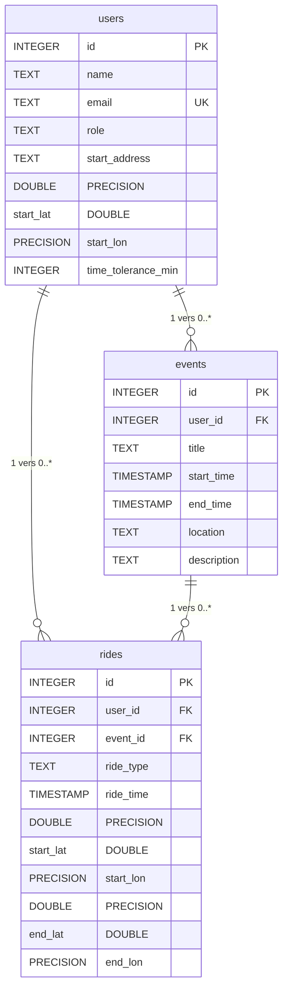

# Schéma de Base de Données - Projet Covoiturage

## Vue d'ensemble

Cette base de données PostgreSQL gère les utilisateurs, leurs événements (cours) et les trajets de covoiturage associés.

## Diagramme ER (Mermaid)

## Description des tables

### Table `users`
Représente les étudiants utilisateurs de l'application de covoiturage.

| Colonne | Type | Contraintes | Description |
|---------|------|-------------|-------------|
| `id` | INTEGER | PRIMARY KEY | Identifiant auto-incrémenté |
| `name` | TEXT | NOT NULL | Nom complet de l'utilisateur |
| `email` | TEXT | UNIQUE, NOT NULL | Adresse email unique |
| `role` | TEXT | NOT NULL | Rôle : "driver", "passenger" ou "both" |
| `start_address` | TEXT | DEFAULT '' | Adresse lisible du point de départ |
| `start_lat` | DOUBLE PRECISION | NOT NULL | Latitude du point de départ |
| `start_lon` | DOUBLE PRECISION | NOT NULL | Longitude du point de départ |
| `time_tolerance_min` | INTEGER | NOT NULL | Tolérance horaire en minutes |

### Table `events`
Représente les événements de l'emploi du temps (cours, TD, etc.).

| Colonne | Type | Contraintes | Description |
|---------|------|-------------|-------------|
| `id` | INTEGER | PRIMARY KEY | Identifiant auto-incrémenté |
| `user_id` | INTEGER | FOREIGN KEY, NOT NULL | Référence vers `users(id)` |
| `title` | TEXT | NOT NULL | Titre de l'événement |
| `start_time` | TIMESTAMP | NOT NULL | Date et heure de début (format ISO 8601) |
| `end_time` | TIMESTAMP | NOT NULL | Date et heure de fin (format ISO 8601) |
| `location` | TEXT |  | Lieu de l'événement |
| `description` | TEXT |  | Description détaillée |

### Table `rides`
Représente les trajets de covoiturage générés depuis les événements.

| Colonne | Type | Contraintes | Description |
|---------|------|-------------|-------------|
| `id` | INTEGER | PRIMARY KEY | Identifiant auto-incrémenté |
| `user_id` | INTEGER | FOREIGN KEY, NOT NULL | Référence vers `users(id)` |
| `event_id` | INTEGER | FOREIGN KEY, NOT NULL | Référence vers `events(id)` |
| `ride_type` | TEXT | NOT NULL | Type : "to_campus" ou "from_campus" |
| `ride_time` | TIMESTAMP | NOT NULL | Date et heure du trajet (format ISO 8601) |
| `start_lat` | DOUBLE PRECISION | NOT NULL | Latitude du point de départ |
| `start_lon` | DOUBLE PRECISION | NOT NULL | Longitude du point de départ |
| `end_lat` | DOUBLE PRECISION | NOT NULL | Latitude du point d'arrivée |
| `end_lon` | DOUBLE PRECISION | NOT NULL | Longitude du point d'arrivée |

## Relations détaillées

### users → events (1 : 0..*)
- **Cardinalité** : Un utilisateur possède zéro ou plusieurs événements
- **Contrainte** : Un événement appartient obligatoirement à exactement un utilisateur
- **Clé étrangère** : `events.user_id` → `users.id` (NOT NULL)

### users → rides (1 : 0..*)
- **Cardinalité** : Un utilisateur crée zéro ou plusieurs trajets
- **Contrainte** : Un trajet appartient obligatoirement à exactement un utilisateur
- **Clé étrangère** : `rides.user_id` → `users.id` (NOT NULL)

### events → rides (1 : 0..*)
- **Cardinalité** : Un événement génère zéro ou plusieurs trajets
- **Contrainte** : Un trajet est associé obligatoirement à exactement un événement
- **Clé étrangère** : `rides.event_id` → `events.id` (NOT NULL)

## Contraintes d'intégrité

- Les clés étrangères sont appliquées par PostgreSQL
- Transactions ACID et concurrence gérées par le serveur
- Email unique pour chaque utilisateur

## Indexes implicites

PostgreSQL crée automatiquement des index pour :
- Les clés primaires (`id` sur chaque table)
- Les contraintes UNIQUE (`email` sur `users`)
