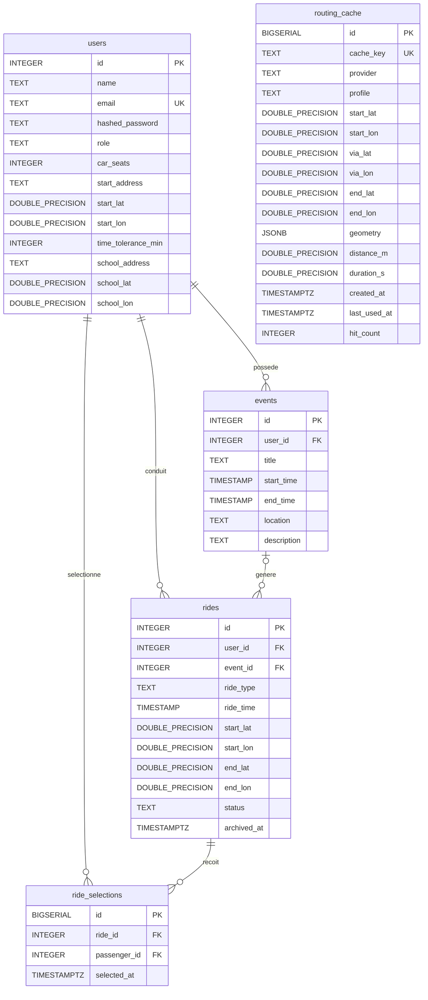

# Schema de base de donnees

## Vue d'ensemble

La base PostgreSQL conserve les profils, les cours importes, les trajets
generes, les choix de covoiturage et le cache technique des itineraires.

Les roles sont exclusifs : un utilisateur est soit `driver`, soit
`passenger`. Un conducteur declare dans son profil entre une et quatre places
passagers. Le conducteur lui-meme n'est pas inclus dans ce nombre.

## Diagramme ER


```mermaid
erDiagram
    users ||--o{ events : possede
    users ||--o{ rides : conduit
    events o|--o{ rides : genere
    users ||--o{ ride_selections : selectionne
    rides ||--o{ ride_selections : recoit

    users {
        INTEGER id PK
        TEXT name
        TEXT email UK
        TEXT hashed_password
        TEXT role
        INTEGER car_seats
        TEXT start_address
        DOUBLE_PRECISION start_lat
        DOUBLE_PRECISION start_lon
        INTEGER time_tolerance_min
        TEXT school_address
        DOUBLE_PRECISION school_lat
        DOUBLE_PRECISION school_lon
    }

    events {
        INTEGER id PK
        INTEGER user_id FK
        TEXT title
        TIMESTAMP start_time
        TIMESTAMP end_time
        TEXT location
        TEXT description
    }

    rides {
        INTEGER id PK
        INTEGER user_id FK
        INTEGER event_id FK
        TEXT ride_type
        TIMESTAMP ride_time
        DOUBLE_PRECISION start_lat
        DOUBLE_PRECISION start_lon
        DOUBLE_PRECISION end_lat
        DOUBLE_PRECISION end_lon
        TEXT status
        TIMESTAMPTZ archived_at
    }

    ride_selections {
        BIGSERIAL id PK
        INTEGER ride_id FK
        INTEGER passenger_id FK
        TIMESTAMPTZ selected_at
    }

    routing_cache {
        BIGSERIAL id PK
        TEXT cache_key UK
        TEXT provider
        TEXT profile
        DOUBLE_PRECISION start_lat
        DOUBLE_PRECISION start_lon
        DOUBLE_PRECISION via_lat
        DOUBLE_PRECISION via_lon
        DOUBLE_PRECISION end_lat
        DOUBLE_PRECISION end_lon
        JSONB geometry
        DOUBLE_PRECISION distance_m
        DOUBLE_PRECISION duration_s
        TIMESTAMPTZ created_at
        TIMESTAMPTZ last_used_at
        INTEGER hit_count
    }
```

`routing_cache` est volontairement independante des trajets : sa cle est
calculee a partir des coordonnees, du fournisseur, du profil de conduite et
de la version du cache.

## Table `users`

| Colonne | Type | Contraintes | Description |
|---|---|---|---|
| `id` | INTEGER | PRIMARY KEY | Identifiant utilisateur |
| `name` | TEXT | NOT NULL | Nom complet |
| `email` | TEXT | UNIQUE, NOT NULL | Adresse de connexion |
| `hashed_password` | TEXT | NOT NULL | Mot de passe hache |
| `role` | TEXT | NOT NULL, CHECK | `driver` ou `passenger` uniquement |
| `car_seats` | INTEGER | NULL, CHECK | Places passagers du conducteur, de 1 a 4 |
| `start_address` | TEXT |  | Adresse de depart |
| `start_lat`, `start_lon` | DOUBLE PRECISION | NOT NULL | Coordonnees de depart |
| `time_tolerance_min` | INTEGER | NOT NULL | Tolerance horaire |
| `school_address` | TEXT |  | Adresse de l'etablissement |
| `school_lat`, `school_lon` | DOUBLE PRECISION | NOT NULL | Coordonnees de l'etablissement |

La contrainte de capacite est liee au role :

```text
driver    -> car_seats entre 1 et 4
passenger -> car_seats = NULL
```

La capacite est une propriete du profil conducteur. Elle n'est pas dupliquee
dans chaque trajet.

## Table `events`

| Colonne | Type | Contraintes | Description |
|---|---|---|---|
| `id` | INTEGER | PRIMARY KEY | Identifiant du cours |
| `user_id` | INTEGER | FK `users.id`, NOT NULL | Proprietaire du planning |
| `title` | TEXT | NOT NULL | Intitule du cours |
| `start_time`, `end_time` | TIMESTAMP | NOT NULL | Debut et fin du cours |
| `location` | TEXT |  | Lieu |
| `description` | TEXT |  | Description importee |

## Table `rides`

| Colonne | Type | Contraintes | Description |
|---|---|---|---|
| `id` | INTEGER | PRIMARY KEY | Identifiant du trajet |
| `user_id` | INTEGER | FK `users.id`, NOT NULL | Utilisateur a l'origine du trajet |
| `event_id` | INTEGER | FK `events.id`, NULL | Cours ayant genere le trajet |
| `ride_type` | TEXT | NOT NULL | `to_campus` ou `from_campus` |
| `ride_time` | TIMESTAMP | NOT NULL | Heure de depart |
| `start_lat`, `start_lon` | DOUBLE PRECISION | NOT NULL | Point de depart |
| `end_lat`, `end_lon` | DOUBLE PRECISION | NOT NULL | Destination |
| `status` | TEXT | NOT NULL, CHECK | `active` ou `archived` |
| `archived_at` | TIMESTAMPTZ | NULL | Date d'archivage |

Les trajets termines restent dans cette table. Ils passent de `active` a
`archived` et sont exclus du matching. Aucun transfert vers une seconde table
d'archives n'est necessaire.

`event_id` accepte `NULL` et utilise `ON DELETE SET NULL`. Un nouvel import de
planning peut ainsi remplacer les cours actifs sans supprimer l'historique des
trajets.

## Table `ride_selections`

| Colonne | Type | Contraintes | Description |
|---|---|---|---|
| `id` | BIGSERIAL | PRIMARY KEY | Identifiant de la selection |
| `ride_id` | INTEGER | FK `rides.id`, NOT NULL | Trajet conducteur choisi |
| `passenger_id` | INTEGER | FK `users.id`, NOT NULL | Passager connecte |
| `selected_at` | TIMESTAMPTZ | NOT NULL | Date du choix |

La paire `(ride_id, passenger_id)` est unique. Les deux cles etrangeres sont
en `ON DELETE CASCADE` afin qu'une suppression explicite d'un trajet ou d'un
compte ne laisse pas de selection orpheline.

Une selection occupe une place. Le nombre restant n'est pas stocke :

```text
places_restantes = users.car_seats - COUNT(ride_selections.id)
```

Un trajet dont le resultat vaut zero est complet. Il reste visible dans les
offres du conducteur, mais n'est plus retourne aux passagers par le matching.

## Table `routing_cache`

| Colonne | Type | Contraintes | Description |
|---|---|---|---|
| `id` | BIGSERIAL | PRIMARY KEY | Identifiant technique |
| `cache_key` | TEXT | UNIQUE, NOT NULL | Empreinte des parametres de routing |
| `provider`, `profile` | TEXT | NOT NULL | Fournisseur et profil routier |
| `start_lat`, `start_lon` | DOUBLE PRECISION | NOT NULL | Depart |
| `via_lat`, `via_lon` | DOUBLE PRECISION | NULL | Point de recuperation eventuel |
| `end_lat`, `end_lon` | DOUBLE PRECISION | NOT NULL | Destination |
| `geometry` | JSONB | NOT NULL | Trace cartographique |
| `distance_m`, `duration_s` | DOUBLE PRECISION | NOT NULL | Distance et duree |
| `created_at`, `last_used_at` | TIMESTAMPTZ | NOT NULL | Suivi du cache |
| `hit_count` | INTEGER | NOT NULL | Nombre de reutilisations |

Les entrees du cache n'expirent pas automatiquement. Un changement des
parametres de routing produit une nouvelle `cache_key`.

## Regles d'integrite principales

- Les roles `driver` et `passenger` sont mutuellement exclusifs.
- Seul un conducteur possede une capacite, comprise entre 1 et 4.
- Une personne ne peut selectionner deux fois le meme trajet.
- La selection et l'annulation sont effectuees pour l'utilisateur connecte.
- La prise de la derniere place est protegee par une transaction et un
  verrouillage du trajet.
- Les trajets archives, passes ou complets sont filtres avant les appels au
  service externe d'itineraires.

## Indexes

PostgreSQL cree automatiquement les index des cles primaires et des
contraintes `UNIQUE`. Les index explicites utiles sont :

- `idx_rides_status_time` sur `(status, ride_time)` ;
- `idx_ride_selections_passenger` sur `passenger_id` ;
- `idx_routing_cache_last_used_at` sur `last_used_at`.
