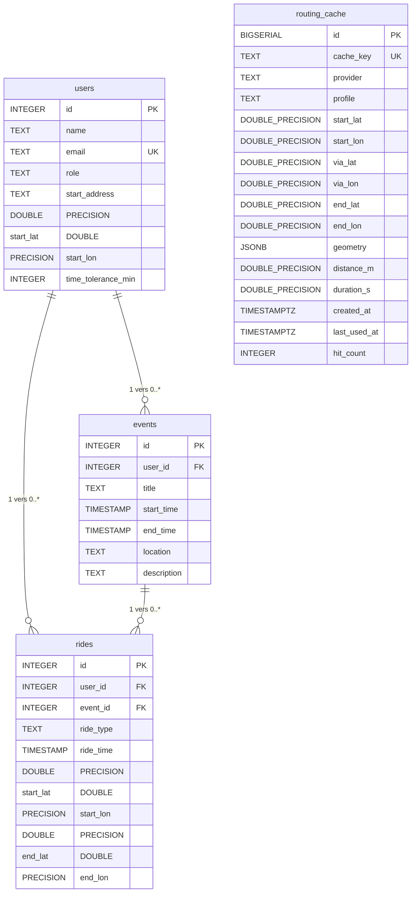

# Schéma de Base de Données - Projet Covoiturage

## Vue d'ensemble

Cette base de données PostgreSQL gère les utilisateurs, leurs événements
(cours), les trajets de covoiturage associés et le cache technique des
itinéraires calculés par le fournisseur de routing.

## Diagramme ER (Mermaid)

```mermaid
erDiagram
    users ||--o{ events : "1 vers 0..*"
    users ||--o{ rides : "1 vers 0..*"
    events ||--o{ rides : "1 vers 0..*"

    users {
        INTEGER id PK
        TEXT name
        TEXT email UK
        TEXT role
        TEXT start_address
        DOUBLE PRECISION start_lat
        DOUBLE PRECISION start_lon
        INTEGER time_tolerance_min
    }

    events {
        INTEGER id PK
        INTEGER user_id FK
        TEXT title
        TIMESTAMP start_time
        TIMESTAMP end_time
        TEXT location
        TEXT description
    }

    rides {
        INTEGER id PK
        INTEGER user_id FK
        INTEGER event_id FK
        TEXT ride_type
        TIMESTAMP ride_time
        DOUBLE PRECISION start_lat
        DOUBLE PRECISION start_lon
        DOUBLE PRECISION end_lat
        DOUBLE PRECISION end_lon
    }

    routing_cache {
        BIGSERIAL id PK
        TEXT cache_key UK
        TEXT provider
        TEXT profile
        DOUBLE_PRECISION start_lat
        DOUBLE_PRECISION start_lon
        DOUBLE_PRECISION via_lat
        DOUBLE_PRECISION via_lon
        DOUBLE_PRECISION end_lat
        DOUBLE_PRECISION end_lon
        JSONB geometry
        DOUBLE_PRECISION distance_m
        DOUBLE_PRECISION duration_s
        TIMESTAMPTZ created_at
        TIMESTAMPTZ last_used_at
        INTEGER hit_count
    }
```

## Description des tables

### Table `users`
Représente les étudiants utilisateurs de l'application de covoiturage.

| Colonne | Type | Contraintes | Description |
|---------|------|-------------|-------------|
| `id` | INTEGER | PRIMARY KEY | Identifiant auto-incrémenté |
| `name` | TEXT | NOT NULL | Nom complet de l'utilisateur |
| `email` | TEXT | UNIQUE, NOT NULL | Adresse email unique |
| `role` | TEXT | NOT NULL | Rôle : "driver", "passenger" ou "both" |
| `start_address` | TEXT | DEFAULT '' | Adresse lisible du point de départ |
| `start_lat` | DOUBLE PRECISION | NOT NULL | Latitude du point de départ |
| `start_lon` | DOUBLE PRECISION | NOT NULL | Longitude du point de départ |
| `time_tolerance_min` | INTEGER | NOT NULL | Tolérance horaire en minutes |

### Table `events`
Représente les événements de l'emploi du temps (cours, TD, etc.).

| Colonne | Type | Contraintes | Description |
|---------|------|-------------|-------------|
| `id` | INTEGER | PRIMARY KEY | Identifiant auto-incrémenté |
| `user_id` | INTEGER | FOREIGN KEY, NOT NULL | Référence vers `users(id)` |
| `title` | TEXT | NOT NULL | Titre de l'événement |
| `start_time` | TIMESTAMP | NOT NULL | Date et heure de début (format ISO 8601) |
| `end_time` | TIMESTAMP | NOT NULL | Date et heure de fin (format ISO 8601) |
| `location` | TEXT |  | Lieu de l'événement |
| `description` | TEXT |  | Description détaillée |

### Table `rides`
Représente les trajets de covoiturage générés depuis les événements.

| Colonne | Type | Contraintes | Description |
|---------|------|-------------|-------------|
| `id` | INTEGER | PRIMARY KEY | Identifiant auto-incrémenté |
| `user_id` | INTEGER | FOREIGN KEY, NOT NULL | Référence vers `users(id)` |
| `event_id` | INTEGER | FOREIGN KEY, NOT NULL | Référence vers `events(id)` |
| `ride_type` | TEXT | NOT NULL | Type : "to_campus" ou "from_campus" |
| `ride_time` | TIMESTAMP | NOT NULL | Date et heure du trajet (format ISO 8601) |
| `start_lat` | DOUBLE PRECISION | NOT NULL | Latitude du point de départ |
| `start_lon` | DOUBLE PRECISION | NOT NULL | Longitude du point de départ |
| `end_lat` | DOUBLE PRECISION | NOT NULL | Latitude du point d'arrivée |
| `end_lon` | DOUBLE PRECISION | NOT NULL | Longitude du point d'arrivée |

### Table `routing_cache`

Stocke les réponses ORS réussies afin qu'un même itinéraire ne consomme pas
de nouveau quota. Cette table technique n'a pas de clé étrangère vers
`rides` : sa clé est calculée à partir des coordonnées, du fournisseur, du
profil de conduite et de la version du cache.

| Colonne | Type | Contraintes | Description |
|---------|------|-------------|-------------|
| `id` | BIGSERIAL | PRIMARY KEY | Identifiant technique |
| `cache_key` | TEXT | UNIQUE, NOT NULL | Empreinte stable des paramètres de routing |
| `provider` | TEXT | NOT NULL | Fournisseur, actuellement `ors` |
| `profile` | TEXT | NOT NULL | Profil, actuellement `driving-car` |
| `start_lat`, `start_lon` | DOUBLE PRECISION | NOT NULL | Point de départ |
| `via_lat`, `via_lon` | DOUBLE PRECISION | NULL | Point de récupération éventuel |
| `end_lat`, `end_lon` | DOUBLE PRECISION | NOT NULL | Destination |
| `geometry` | JSONB | NOT NULL | Tracé cartographique sous forme de points |
| `distance_m` | DOUBLE PRECISION | NOT NULL | Distance calculée en mètres |
| `duration_s` | DOUBLE PRECISION | NOT NULL | Durée calculée en secondes |
| `created_at` | TIMESTAMPTZ | NOT NULL | Date du calcul |
| `last_used_at` | TIMESTAMPTZ | NOT NULL | Dernière réutilisation |
| `hit_count` | INTEGER | NOT NULL | Nombre de réutilisations |

Les entrées n'expirent pas automatiquement. Un changement des paramètres de
routing génère une nouvelle `cache_key` et donc un nouveau calcul.

## Relations détaillées

### users → events (1 : 0..*)
- **Cardinalité** : Un utilisateur possède zéro ou plusieurs événements
- **Contrainte** : Un événement appartient obligatoirement à exactement un utilisateur
- **Clé étrangère** : `events.user_id` → `users.id` (NOT NULL)

### users → rides (1 : 0..*)
- **Cardinalité** : Un utilisateur crée zéro ou plusieurs trajets
- **Contrainte** : Un trajet appartient obligatoirement à exactement un utilisateur
- **Clé étrangère** : `rides.user_id` → `users.id` (NOT NULL)

### events → rides (1 : 0..*)
- **Cardinalité** : Un événement génère zéro ou plusieurs trajets
- **Contrainte** : Un trajet est associé obligatoirement à exactement un événement
- **Clé étrangère** : `rides.event_id` → `events.id` (NOT NULL)

## Contraintes d'intégrité

- Les clés étrangères sont appliquées par PostgreSQL
- Transactions ACID et concurrence gérées par le serveur
- Email unique pour chaque utilisateur

## Indexes implicites

PostgreSQL crée automatiquement des index pour :
- Les clés primaires (`id` sur chaque table)
- Les contraintes UNIQUE (`email` sur `users`)
- La contrainte UNIQUE (`cache_key` sur `routing_cache`)

Un index explicite existe également sur `routing_cache.last_used_at` pour le
suivi technique du cache.
