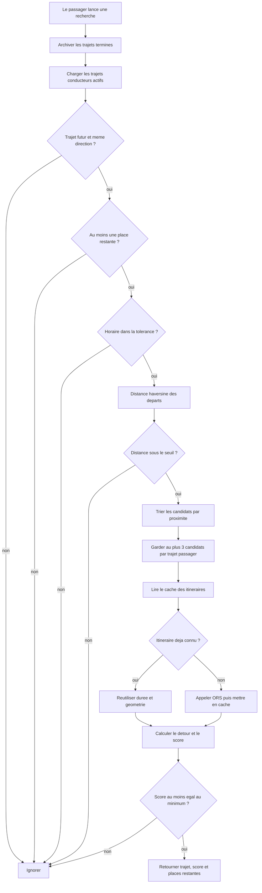

# Algorithme de matching covoiturage

Code source : `backend/services/matching.py` pour le moteur,
`backend/services/routing.py` pour les itineraires et
`backend/database/manager.py` pour les places et les selections.

## Principe

La recherche est reservee aux utilisateurs ayant le role `passenger`.
L'application compare un trajet du passager avec les trajets proposes par des
utilisateurs ayant le role `driver`, puis classe les correspondances selon les
horaires et le detour reel.

Un conducteur ne recherche pas de covoiturage. Il consulte ses trajets
proposes, leurs places restantes et les passagers inscrits.

## Vue d'ensemble



## 1. Roles

Les roles sont exclusifs :

```text
driver
passenger
```

Le role `both` n'existe plus. Le backend refuse l'acces aux endpoints de
recherche et de selection lorsqu'un conducteur les appelle.

La capacite est stockee sur le profil conducteur :

```text
driver    -> car_seats entre 1 et 4
passenger -> car_seats = NULL
```

## 2. Archivage avant la recherche

Un trajet reste dans `rides` mais passe de `active` a `archived` lorsqu'il est
termine. Comme la base ne stocke pas encore la duree exacte du trajet, la
regle retenue est un delai de trois heures apres `ride_time`.

L'archivage est idempotent et peut etre declenche avant les lectures metier :

```sql
UPDATE rides
SET status = 'archived', archived_at = NOW()
WHERE status = 'active'
  AND ride_time < LOCALTIMESTAMP - INTERVAL '3 hours';
```

Les trajets archives restent consultables dans l'historique, avec leurs
selections, mais ne participent plus au matching.

## 3. Places restantes

Une ligne de `ride_selections` represente un passager ayant choisi un trajet.
Le nombre de places restantes est calcule, et non duplique dans `rides` :

```text
places_restantes = conducteur.car_seats - nombre_de_selections
```

Un trajet complet est exclu avant tout appel a OpenRouteService. Il ne consomme
donc pas de quota de routing et n'apparait pas dans les resultats du passager.
Il reste visible au conducteur afin qu'il puisse consulter tous ses passagers.

## 4. Prefiltres sans appel reseau

Pour chaque paire `(trajet_passager, trajet_conducteur)`, le backend applique
les controles suivants dans cet ordre :

1. Le compte courant doit etre un passager.
2. L'autre utilisateur doit etre un conducteur avec une capacite valide.
3. Le trajet conducteur doit etre `active` et futur.
4. Il doit rester au moins une place.
5. Le passager ne doit pas avoir deja selectionne ce trajet conducteur.
6. Le passager ne doit pas avoir de reservation active a la meme date et a la
   meme minute que le trajet conducteur.
7. Les deux trajets doivent avoir le meme sens, `to_campus` ou `from_campus`.
8. L'ecart horaire doit respecter la tolerance des profils.
9. La distance a vol d'oiseau entre les departs doit etre inferieure a
   `MAX_DISTANCE_KM`.

Les candidats restants sont regroupes par trajet du passager et tries par
distance de depart. Seuls les `MAX_DETOUR_CANDIDATES` premiers de chaque groupe
passent aux calculs d'itineraires.

## 5. Score de compatibilite

Le score reste compris entre 0 et 100 et repose sur les criteres existants.
Le nombre de places est une condition obligatoire, pas un bonus de score.

### Horaires, 0 a 50 points

L'ecart entre les heures des deux trajets est compare a la tolerance horaire
la plus large. Un horaire identique obtient le maximum.

### Detour reel, 0 a 50 points

Le moteur compare :

- l'itineraire direct du conducteur ;
- l'itineraire conducteur vers passager puis destination.

Le temps ajoute est la difference entre les deux durees. Le score diminue
jusqu'au seuil `MAX_DETOUR_MIN`.

### Proximite des departs, 0 a 10 points

Une courte distance haversine entre les points de depart apporte un bonus.
Le score total est toujours plafonne a 100.

Seuls les matchs dont le score atteint `MIN_MATCH_SCORE` sont retournes. Le
tri final utilise le score decroissant, puis le detour croissant. Si plusieurs
entrees du planning passager correspondent au meme `ride_id`, seule la
meilleure correspondance est retournee.

## 6. Donnees retournees

Chaque match expose notamment :

```text
ride_id
driver_id
driver_name
car_seats
available_seats
score
extra_time_min
route_geometry
```

`ride_id` identifie la proposition a selectionner. `available_seats` est
calcule au moment de la recherche.

## 7. Selection d'un trajet

Le clic depuis les resultats ouvre d'abord une page de recapitulatif avec la
carte, l'horaire, le conducteur, le passager, la compatibilite et les places
restantes. Aucune donnee n'est inseree avant la validation finale.

Le passager connecte selectionne un trajet conducteur. Le backend :

1. verrouille la ligne du passager, puis celle du trajet avec `SELECT ... FOR UPDATE` ;
2. verifie le role, l'etat du trajet et l'identite du conducteur ;
3. refuse une reservation deja presente pour ce trajet ou cette meme minute ;
4. recompte les selections et refuse le trajet s'il est complet ;
5. insere la selection et retourne le nouveau nombre de places.

Le verrouillage empeche deux passagers de prendre simultanement la derniere
place. La contrainte unique sur `(ride_id, passenger_id)` interdit une double
selection du meme trajet par le meme utilisateur. Le backend verrouille aussi
la ligne du passager et refuse une autre selection a la meme minute, meme si
deux confirmations arrivent simultanement depuis deux onglets.

L'annulation supprime uniquement la selection appartenant au passager
connecte. La place est alors liberee automatiquement par le prochain calcul.

## 8. Cache des itineraires et quota ORS

Les itineraires directs et avec point de passage sont enregistres dans
`routing_cache`. Une route connue est reutilisee sans nouvel appel externe.

Pour chaque trajet du passager, trois conducteurs au maximum sont evalues. Sans
cache, cela represente au plus trois routes directes et trois detours. Les
filtres de role, d'etat, de places, d'horaire et de distance ont tous lieu
avant ces appels.

## Configuration

| Variable | Defaut | Role |
|---|---:|---|
| `MAX_DISTANCE_KM` | 10.0 | Distance maximale entre les departs |
| `MAX_DETOUR_MIN` | 12.0 | Detour maximal accepte |
| `MAX_DETOUR_CANDIDATES` | 3 | Candidats evalues via ORS par trajet |
| `MIN_MATCH_SCORE` | 60 | Score minimum |
| `ORS_MAX_REQUESTS_PER_MINUTE` | 35 | Limite locale de protection |
