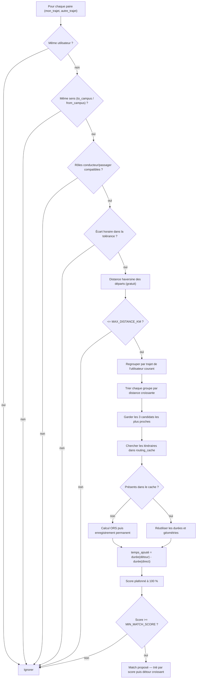

# Algorithme de matching covoiturage

Code source : `backend/services/matching.py` (moteur) et
`backend/services/routing.py` (appels OpenRouteService).

## Principe

Pour un utilisateur donné, on cherche parmi tous les trajets (`rides`) de la
base ceux qui peuvent former une paire conducteur/passager compatible sur un
même trajet (aller vers le campus ou retour), puis on les classe par
pertinence. Un `Ride` est un aller simple (domicile → école ou école →
domicile) à une heure donnée, généré à partir des cours importés
(`backend/api/routes/rides.py::generate_rides_for_user`).

## Diagramme

## 1. Filtrage (aucun appel réseau)

Pour chaque paire `(mon_trajet, autre_trajet)` :

1. Ignorer si c'est le même utilisateur.
2. Ignorer si les deux trajets ne vont pas dans le même sens
   (`to_campus`/`from_campus`).
3. Déterminer les rôles : il faut un conducteur (`role` = `driver`/`both`) et
   un passager (`role` = `passenger`/`both`) compatibles entre les deux
   utilisateurs — sinon la paire est ignorée.
4. Écarter la paire si l'écart entre les horaires dépasse la tolérance des
   utilisateurs. Ce contrôle a lieu avant tout appel à ORS.
5. Calculer la distance à vol d'oiseau (haversine) entre les deux points de
   départ. Si elle dépasse `MAX_DISTANCE_KM` (10 km par défaut), la paire est
   écartée d'entrée — c'est un filtre bon marché avant de solliciter le
   service de routing.

Les candidats survivants sont regroupés **par trajet de l'utilisateur
courant**, triés par distance de départ croissante, et seuls les
**`MAX_DETOUR_CANDIDATES` premiers de chaque groupe** (3 par défaut) passent
à l'étape suivante. La borne fonctionne donc de la même manière lorsque
l'utilisateur est conducteur ou passager.

## 2. Score (avec appels au service de routing)

Pour chaque candidat retenu, le score (0 à 100) se compose de trois parties :

### a. Horaires (0-50 pts)

Écart en minutes entre les deux heures de trajet, comparé à la tolérance
horaire la plus large des deux utilisateurs (`time_tolerance_min`). Écart nul
→ 50 pts ; écart au-delà de la tolérance → 0 pt.

### b. Temps de détour réel (0-50 pts) — le critère principal

On compare deux itinéraires calculés via OpenRouteService :

- **Trajet direct** du conducteur : domicile → école (mis en cache par
  trajet, un seul appel réutilisé pour tous ses candidats passagers).
- **Trajet avec détour** : domicile conducteur → domicile passager → école
  conducteur (`routing_service.get_route_via_waypoint`, un appel par paire
  candidate retenue).

`temps_ajoute = durée(détour) - durée(direct)`, en minutes. Si ce temps est
sous `MAX_DETOUR_MIN` (12 min par défaut), le score décroît linéairement
jusqu'à 0 au seuil. Ce n'est **pas** une distance géométrique à un tracé fixe
— voir la section suivante pour l'historique.

### c. Bonus de proximité des départs (0-10 pts)

Distance haversine entre les deux points de départ, plus elle est faible
plus le bonus est élevé (plafonné à `MAX_DISTANCE_KM`).

Le score final = somme des trois. Seuls les matchs avec un score ≥
`MIN_MATCH_SCORE` (60 par défaut) sont retenus. Tri final : score décroissant,
puis temps de détour croissant (le candidat qui ajoute le moins de temps est
proposé en premier). Le pourcentage exposé est toujours plafonné à 100 %.

## Cache des itinéraires

Les itinéraires directs et avec point de passage sont enregistrés dans la
table `routing_cache`. La clé dépend des coordonnées arrondies, du fournisseur,
du profil de conduite et de la version du cache. Une route connue ne consomme
donc aucun nouvel appel ORS.

Le cache n'expire pas automatiquement. Une modification des coordonnées, du
profil, du fournisseur ou de `CACHE_VERSION` produit une nouvelle clé et
entraîne un nouveau calcul. Seuls les résultats ORS réussis sont enregistrés.

## Pourquoi le temps de détour réel plutôt qu'une distance au tracé ?

Avant, le score de proximité se basait sur la distance géométrique la plus
courte entre le point de départ du passager et n'importe quel point du
**trajet direct** du conducteur (sans passager). Problème : ce trajet direct
peut emprunter un chemin (ex. la rocade) qui évite un quartier où pourtant un
léger détour serait tout à fait raisonnable pour récupérer quelqu'un — et
l'algorithme ne comparait jamais deux personnes allant vers des écoles
différentes autrement que par chance géographique, puisqu'il ne regardait
qu'un seul tracé figé. Le calcul du détour réel (avec le point de passage par
le passager) capture correctement ce genre de cas, au prix de plus d'appels
au service de routing — d'où la limite `MAX_DETOUR_CANDIDATES` ci-dessus.

## Configuration

Toutes les constantes citées sont définies dans `backend/core/config.py` et
surchargeables via `.env` (voir `doc/CONFIGURATION.md`) :

| Variable | Défaut | Rôle |
|---|---|---|
| `MAX_DISTANCE_KM` | 10.0 | Filtre bon marché + bonus proximité départs |
| `MAX_DETOUR_MIN` | 12.0 | Seuil de temps de détour accepté |
| `MAX_DETOUR_CANDIDATES` | 3 | Nb max de candidats évalués via ORS par trajet de l'utilisateur |
| `MIN_MATCH_SCORE` | 60 | Score minimum pour qu'un match soit proposé |
| `ORS_MAX_REQUESTS_PER_MINUTE` | 35 | Limite locale de sécurité avant la limite ORS |

## FAQ — capacité max d'appels à l'API de routing

Pour chaque trajet de l'utilisateur courant, trois candidats au maximum sont
évalués. Sans aucune donnée en cache, cela représente au pire :

- utilisateur conducteur : 1 route directe + 3 détours, soit 4 appels ;
- utilisateur passager : jusqu'à 3 routes directes + 3 détours, soit 6 appels.

Ces nombres diminuent dès que des itinéraires sont présents dans
`routing_cache`. Le client bloque aussi localement au-delà de 35 nouvelles
requêtes par minute. Un quota quotidien épuisé produit immédiatement une
erreur explicite au lieu de laisser l'interface attendre 45 secondes.
