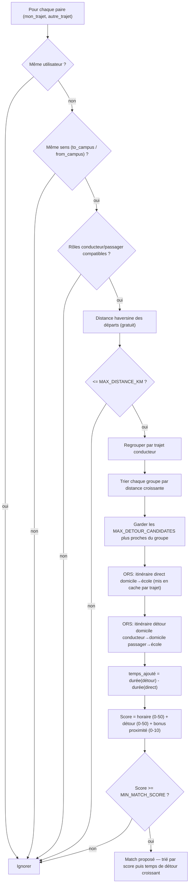

# Algorithme de matching covoiturage

Code source : `backend/services/matching.py` (moteur) et
`backend/services/routing.py` (appels OpenRouteService).

## Principe

Pour un utilisateur donné, on cherche parmi tous les trajets (`rides`) de la
base ceux qui peuvent former une paire conducteur/passager compatible sur un
même trajet (aller vers le campus ou retour), puis on les classe par
pertinence. Un `Ride` est un aller simple (domicile → école ou école →
domicile) à une heure donnée, généré à partir des cours importés
(`backend/api/routes/rides.py::generate_rides_for_user`).

## Diagramme



## 1. Filtrage (aucun appel réseau)

Pour chaque paire `(mon_trajet, autre_trajet)` :

1. Ignorer si c'est le même utilisateur.
2. Ignorer si les deux trajets ne vont pas dans le même sens
   (`to_campus`/`from_campus`).
3. Déterminer les rôles : il faut un conducteur (`role` = `driver`/`both`) et
   un passager (`role` = `passenger`/`both`) compatibles entre les deux
   utilisateurs — sinon la paire est ignorée.
4. Calculer la distance à vol d'oiseau (haversine) entre les deux points de
   départ. Si elle dépasse `MAX_DISTANCE_KM` (10 km par défaut), la paire est
   écartée d'entrée — c'est un filtre bon marché avant de solliciter le
   service de routing.

Les candidats survivants sont regroupés **par trajet conducteur** (une clé
= un `Ride` précis), triés par distance de départ croissante, et seuls les
**`MAX_DETOUR_CANDIDATES` premiers de chaque groupe** (8 par défaut) passent
à l'étape suivante.

Cette limite borne le nombre de *passagers évalués pour un même
conducteur*, pas le nombre total de groupes (donc pas le nombre total
d'appels ORS d'une recherche). Elle est très efficace quand l'utilisateur
courant est **conducteur** (un seul groupe, potentiellement beaucoup de
passagers candidats, coupé à 8). Elle protège beaucoup moins bien quand
l'utilisateur courant est **passager** : chaque conducteur compatible forme
son propre groupe (généralement 1-2 candidats dedans, sous la limite de
toute façon), donc le nombre d'appels grandit avec le nombre de conducteurs
compatibles dans la base, pas seulement avec `MAX_DETOUR_CANDIDATES`. Voir
le calcul dans la FAQ ci-dessous.

## 2. Score (avec appels au service de routing)

Pour chaque candidat retenu, le score (0 à 100) se compose de trois parties :

### a. Horaires (0-50 pts)

Écart en minutes entre les deux heures de trajet, comparé à la tolérance
horaire la plus large des deux utilisateurs (`time_tolerance_min`). Écart nul
→ 50 pts ; écart au-delà de la tolérance → 0 pt.

### b. Temps de détour réel (0-50 pts) — le critère principal

On compare deux itinéraires calculés via OpenRouteService :

- **Trajet direct** du conducteur : domicile → école (mis en cache par
  trajet, un seul appel réutilisé pour tous ses candidats passagers).
- **Trajet avec détour** : domicile conducteur → domicile passager → école
  conducteur (`routing_service.get_route_via_waypoint`, un appel par paire
  candidate retenue).

`temps_ajoute = durée(détour) - durée(direct)`, en minutes. Si ce temps est
sous `MAX_DETOUR_MIN` (12 min par défaut), le score décroît linéairement
jusqu'à 0 au seuil. Ce n'est **pas** une distance géométrique à un tracé fixe
— voir la section suivante pour l'historique.

### c. Bonus de proximité des départs (0-10 pts)

Distance haversine entre les deux points de départ, plus elle est faible
plus le bonus est élevé (plafonné à `MAX_DISTANCE_KM`).

Le score final = somme des trois. Seuls les matchs avec un score ≥
`MIN_MATCH_SCORE` (60 par défaut) sont retenus. Tri final : score décroissant,
puis temps de détour croissant (le candidat qui ajoute le moins de temps est
proposé en premier).

## Pourquoi le temps de détour réel plutôt qu'une distance au tracé ?

Avant, le score de proximité se basait sur la distance géométrique la plus
courte entre le point de départ du passager et n'importe quel point du
**trajet direct** du conducteur (sans passager). Problème : ce trajet direct
peut emprunter un chemin (ex. la rocade) qui évite un quartier où pourtant un
léger détour serait tout à fait raisonnable pour récupérer quelqu'un — et
l'algorithme ne comparait jamais deux personnes allant vers des écoles
différentes autrement que par chance géographique, puisqu'il ne regardait
qu'un seul tracé figé. Le calcul du détour réel (avec le point de passage par
le passager) capture correctement ce genre de cas, au prix de plus d'appels
au service de routing — d'où la limite `MAX_DETOUR_CANDIDATES` ci-dessus.

## Configuration

Toutes les constantes citées sont définies dans `backend/core/config.py` et
surchargeables via `.env` (voir `doc/CONFIGURATION.md`) :

| Variable | Défaut | Rôle |
|---|---|---|
| `MAX_DISTANCE_KM` | 10.0 | Filtre bon marché + bonus proximité départs |
| `MAX_DETOUR_MIN` | 12.0 | Seuil de temps de détour accepté |
| `MAX_DETOUR_CANDIDATES` | 8 | Nb max de candidats évalués via ORS par trajet conducteur |
| `MIN_MATCH_SCORE` | 60 | Score minimum pour qu'un match soit proposé |

## FAQ — capacité max d'appels à l'API de routing

Nombre d'appels ORS pour **une seule** recherche (`find_matches`) :

```
appels ≈ Σ (sur chaque groupe conducteur retenu) [ 1 direct (mis en cache) + min(taille_du_groupe, MAX_DETOUR_CANDIDATES) détours ]
```

Deux cas très différents :

- **Utilisateur courant conducteur** : un seul groupe (son propre trajet),
  donc `MAX_DETOUR_CANDIDATES` (8) borne vraiment le nombre d'appels — au
  pire **1 + 8 = 9 appels** par trajet du conducteur (x2 si `role = both` et
  qu'il a aussi des trajets passager à vérifier).
- **Utilisateur courant passager** : chaque conducteur compatible dans la
  base forme son propre groupe (généralement 1-2 candidats, donc en dessous
  du plafond `MAX_DETOUR_CANDIDATES` de toute façon — la limite ne réduit
  quasiment rien ici). Le nombre d'appels grandit avec le nombre de
  conducteurs compatibles trouvés par le filtre bon marché (direction +
  rôle + `MAX_DISTANCE_KM`), donc avec la taille de la base et sa densité
  géographique.

Avec les 40 profils de test (répartis sur Toulouse/Blagnac/Colomiers, soit
~15 km de diamètre, tous sous le rayon `MAX_DISTANCE_KM` de 10 km entre eux
dans beaucoup de cas), le scénario passager peut encore générer plusieurs
dizaines d'appels — la protection actuelle n'est donc **pas** un plafond
global garanti, seulement un plafond par conducteur. Une vraie borne
globale (ex. couper aussi le nombre total de groupes traités, pas seulement
la taille de chacun) serait nécessaire pour un plafond strict quelle que
soit la taille de la base — pas encore fait, à considérer si la base de
test grandit encore ou si des rate-limits ORS réapparaissent.
